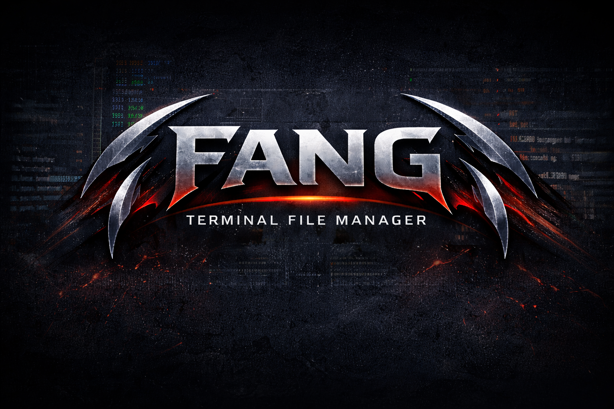

<div align="center">
  

  <p>
    <strong>A modern, blazing-fast TUI file explorer written in Rust</strong>
  </p>

  <p>
    <a href="https://github.com/theburrowhub/fang/actions/workflows/ci-cd.yml"></a>
    <a href="https://github.com/theburrowhub/fang/releases/latest"></a>
    <a href="LICENSE"></a>
  </p>
</div>

---

Fang is a terminal file explorer that feels like a real tool — not a toy.
Syntax-highlighted previews, fuzzy search, Git operations, Makefile integration,
and shell commands, all from the keyboard.

## Features

| | |
|---|---|
| **3-panel layout** | Sidebar tree · file list · preview — responsive to terminal width |
| **Syntax highlighting** | 300+ languages via syntect, base16-ocean.dark theme |
| **Fuzzy search** | Real-time filtering with SkimMatcherV2 (`/`) |
| **Git menu** | status, fetch, pull, push, log, stash, diff — streamed output (`g`) |
| **Makefile integration** | Parse targets and run them with live output (`m`) |
| **Shell commands** | Run any command (with aliases) inside fang (`:`) |
| **Terminal split** | Open a command in a new pane — zellij, tmux, kitty, iTerm2… (`;`) |
| **Open with system** | Open file/dir with the default app or Finder (`o`) |
| **Create files** | New empty file or paste from clipboard — text, images, binary (`n` / `N`) |
| **Window title** | Terminal title updates to current path on every navigation |
| **Header bar** | Git branch + dev environment badges (Python, Go, Node, Rust) |
| **Async everywhere** | Non-blocking UI — previews and long commands run in background |
| **Single binary** | No runtime dependencies |

## Installation

### Homebrew (macOS / Linux)

```bash
brew tap theburrowhub/tap
brew install fang
```

### Cargo

```bash
cargo install --git https://github.com/theburrowhub/fang
```

### Binary download

Grab the latest pre-compiled binary from the [Releases page](https://github.com/theburrowhub/fang/releases/latest):

| Platform | Archive |
|---|---|
| macOS (Apple Silicon) | `fang_VERSION_aarch64-apple-darwin.tar.gz` |
| macOS (Intel) | `fang_VERSION_x86_64-apple-darwin.tar.gz` |
| Linux x86-64 (musl) | `fang_VERSION_x86_64-unknown-linux-musl.tar.gz` |
| Linux ARM64 (musl) | `fang_VERSION_aarch64-unknown-linux-musl.tar.gz` |
| Windows x86-64 | `fang_VERSION_x86_64-pc-windows-msvc.zip` |

```bash
# macOS example
curl -L https://github.com/theburrowhub/fang/releases/latest/download/fang_VERSION_aarch64-apple-darwin.tar.gz \
  | tar -xz && sudo mv fang /usr/local/bin/
```

### Build from source

```bash
git clone https://github.com/theburrowhub/fang
cd fang
cargo build --release
./target/release/fang
```

## Usage

```
fang [directory]        # open in given directory (default: current)
```

## Keybindings

### Navigation

| Key | Action |
|-----|--------|
| `j` / `↓` | Move down |
| `k` / `↑` | Move up |
| `h` / `←` | Go to parent directory |
| `l` / `→` / `Enter` | Enter directory |
| `Tab` | Cycle panel focus (Sidebar → Files → Preview) |
| `s` | Toggle sidebar |
| `p` | Toggle preview |
| `q` / `Ctrl+C` | Quit |

### Search

| Key | Action |
|-----|--------|
| `/` | Start fuzzy search |
| `j` / `k` | Navigate results |
| `Enter` | Open selected |
| `Esc` | Cancel |

### File operations

| Key | Action |
|-----|--------|
| `o` | Open with system default app (macOS: `open`, Linux: `xdg-open`) |
| `n` | New empty file — type filename + Enter |
| `N` | New file from clipboard — pastes text, image, or binary |

### Preview

| Key | Action |
|-----|--------|
| `PgUp` / `PgDn` | Scroll preview |
| `j` / `k` (when preview focused) | Scroll line by line |

### Git menu (`g`)

Opens a menu with the most common git operations. Output streams live into the preview panel.

| Operation | Command |
|-----------|---------|
| Status | `git status` |
| Fetch | `git fetch` |
| Fetch all (prune) | `git fetch --all --prune` |
| Pull | `git pull` |
| Pull (rebase) | `git pull --rebase` |
| Push | `git push` |
| Push (force-with-lease) | `git push --force-with-lease` |
| Push new branch | `git push -u origin HEAD` |
| Log (last 20) | `git log --oneline -20` |
| List branches | `git branch -a` |
| Stash | `git stash` |
| Stash pop | `git stash pop` |
| Diff (stat) | `git diff --stat` |

### Makefile integration (`m`)

When a `Makefile` is present, `m` opens a target picker. Select a target and press `Enter` to run it. Output streams into the preview panel.

### Shell commands

| Key | Behaviour |
|-----|-----------|
| `:` | Run a command in the background — output shown in preview panel. Supports aliases (uses `$SHELL -i`). Interactive input (e.g. `y/N` prompts) is relayed to the process. |
| `;` | Open a command in a **new terminal split** (vertical pane). Detects: Zellij, tmux, kitty, WezTerm, Ghostty, iTerm2, Terminal.app, gnome-terminal, konsole, xterm. |

## Header bar

The top line shows contextual information about the current directory:

```
fang  ⎇ main  rs 1.75.0  node 20.11.0   ~/workspace/fang
```

Detected automatically: Git branch, Python venv version, Go, Node.js, Rust.

## Architecture

```
src/
├── main.rs              # tokio event loop, terminal setup, action dispatch
├── app/
│   ├── state.rs         # AppState — single source of truth
│   ├── events.rs        # async Event enum
│   └── actions.rs       # Action enum, key→action mapping per mode
├── commands/
│   ├── make.rs          # async make execution with streaming
│   ├── git.rs           # async git operations
│   ├── shell.rs         # terminal split detection
│   ├── open.rs          # system default app opener
│   ├── clipboard.rs     # clipboard read (text + images)
│   └── title.rs         # terminal window title via OSC escapes
├── fs/
│   ├── browser.rs       # directory loading, sorting
│   └── metadata.rs      # FileEntry, FileType, format_size
├── preview/
│   ├── text.rs          # syntect syntax highlighting (OnceLock)
│   ├── binary.rs        # hex dump
│   └── makefile.rs      # Makefile parser + preview
├── search/
│   └── fuzzy.rs         # SkimMatcherV2 filtering
└── ui/
    ├── layout.rs        # responsive 3-panel layout
    └── components/
        ├── header.rs    # top bar (git + dev envs)
        ├── sidebar.rs   # breadcrumb tree
        ├── file_list.rs # file browser panel
        ├── preview.rs   # preview panel
        ├── footer.rs    # keybindings bar
        ├── make_modal.rs
        └── git_modal.rs
```

**Key design decisions:**

- **No `Arc<Mutex<AppState>>`** — state is owned exclusively by the event loop thread.
- **`OnceLock` for syntect** — `SyntaxSet` initialised once (~100 ms), reused for all previews.
- **Async preview & commands** — background tokio tasks send results back via `mpsc::UnboundedSender<Event>`.
- **Panic-safe terminal** — custom panic hook restores the terminal before printing.
- **Blank-fill rendering** — preview panel explicitly fills every cell to prevent stale terminal artefacts.

## Contributing

```bash
# Fork, clone, create branch
git checkout -b feat/your-feature

# Run tests
cargo test

# Commit using conventional commits (used for auto-versioning)
git commit -m "feat: add your feature"
git commit -m "fix: fix a bug"
git commit -m "feat!: breaking change"
```

Commits on `main` following the [Conventional Commits](https://www.conventionalcommits.org/) spec trigger automatic releases:

| Prefix | Version bump |
|--------|-------------|
| `feat:` | minor |
| `fix:`, `perf:` | patch |
| `feat!:` / `BREAKING CHANGE` | major |
| `chore:`, `docs:`, `ci:` | no release |

## License

MIT — see [LICENSE](LICENSE).

---

<div align="center">
  Made with ❤️ by <a href="https://github.com/theburrowhub">The Burrow Hub</a>
</div>
